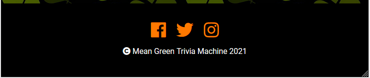

<p align="center">
  
  <br>
 Hello there, <br> We are the Mean Green Trivia Machine 👋
</p>

---

 ** Happy St. Patrick's Day Quiz**

By: LaiMo, Nicola, Simon, Sue, SuzyBee, Tobi, Marina, March 2021<br>
This Project is an Team Event Project organized by [Code Institute](https://www.codeinstitute.net/).

---
## **Contents** ##

- [**Contents**](#contents)
- [**UX (User Experience)**](#ux-user-experience)
  - [**Project Goals**](#project-goals)
  - [**User Goals**](#user-goals)
  - [**User Stories**](#user-stories)
  - [**Site Owner Goals**](#site-owner-goals)
- [**Design Choices**](#design-choices)
  - [**Fonts**](#fonts)
  - [**Colours**](#colours)
  - [**Imagery**](#imagery)
  - [**Wireframes**](#wireframes)
- [**Technologies**](#technologies)
  - [**Languages**](#languages)
  - [**Libraries**](#libraries)
  - [**Tools**](#tools)
- [**Features**](#features)
  - [**Features Implemented**](#features-implemented)
  - [**Responsive Design**](#responsive-design)
  - [**Interactive Elements**](#interactive-elements)
  - [**Future Features**](#future-features)
  - [**Site Construction**](#site-construction)
  - [**Page Layout**](#page-layout)
    - [**INDEX.HTML**](#indexhtml)
    - [**GAME.HTML**](#gamehtml)
  - [**Construction Table**](#construction-table)
- [**Development Lifecycle and Task Allocation**](#development-lifecycle-and-task-allocation)
- [**Project Management**](#project-management)
- [**Version Control**](#version-control)
    - [**Gitpod Workspaces**](#gitpod-workspaces)
    - [**Branches**](#branches)
    - [**Working within a branch**](#working-within-a-branch)
    - [**Merging branches in GitHub**](#merging-branches-in-github)
    - [**Update Gitpod with the latest GitHub commits**](#update-gitpod-with-the-latest-github-commits)
    - [**Pull Requests**](#pull-requests)
- [**Testing**](#testing)
- [**Bugs**](#bugs)
- [**Deployment**](#deployment)
  - [**Running Locally**](#running-locally)
- [**Credits**](#credits)
  - [**Images**](#images)
  - [**Colour**](#colour)
  - [**Inspiration**](#inspiration)
  - [**Acknowledgements**](#acknowledgements)
​

---
## **UX (User Experience)** ##

### **Project Goals** ###
- To come up with a website that will help people to celebrate St Patrick’s day together, while apart.
- We want to make effective use of course knowledge and collaborate together.
- Make a project that works and is practical.
- Work together as a team and ensure each team member feels included and has the opportunity to contribute what they are able and we all have fun and learn the skills necessary for collaboration.
- Give attention to the project presentation and adhere to the theme.
- Build something awesome that we are proud of as a team.
​

The **FEATURES** on the website will:
- Give the user a way to compete with friends and family using an Irish themed quiz game and allow them to keep up to date with our next quizzes through social media pages.
​

We achieved this by:
- Making a fun story and game with various Irish themed questions.
- Providing social media links in the footer section of each page.


### **User Goals** ###
- The user will test their knowledge on Irish culture, history and geography
- The user will learn more about Irish culture, history and geography
- The user will gain points (gold coins) and be able to compare with other users.

​
### **User Stories** ###

- As a **user**, I want the home screen to be simple with a clear indication of what I can do and to be able to navigate it easily.
- As a **user**, I want to play the game so I can compete against my friends and win the game.
- As a **user**, I want to see the button to Start the game and would like to see the answers as I select them and see the score increase as I progress through the game.
- As a **user**, I would like the game to have an Irish theme.
- As a **user**, I want to see social media links in the footer.
- As a **user**, I want to see my score at the end of the quiz.
- As a **user**, I want to know more about St Patrick, so that i have a better knowledge about it.
- As a **user**, I want to see my progress, how many questions are left and how many i already answered.
- As a **user**, I want to give an answer and have feedback whether it is correct or not.
​
### **Site Owner Goals** ###
​
- As a **site owner**, I want to create an interactive website to present a clean, easy to understand display of information.
- As a **site owner**, I want the user to see the social media links in the footer so they know how to interact with us.
- As a **site owner**, I want the user to learn some fun and interesting facts about Ireland.​

​
[Back to contents](#contents)

--- 
## **Design Choices** ##
​
### **Fonts** ###
​
We chose the [Lobster](https://fonts.google.com/specimen/Lobster?preview.text_type=custom#standard-styles) font for the h1-h3 and the [Roboto](https://fonts.google.com/specimen/Roboto?preview.text_type=custom) font as basic and Sans-Serif as default font.
​
### **Colours** ###
​
We chose for the website the Irish and St. Patrick's Day colours.<br>
​
​
​

​
- *Rich Black FOGRA 39* (#010800) - Black
- *Kombu Green* (#273301) - Dark olive green
- *Dark Spring Green* (#157347) - Dark green
- *Avocado* (#5A7502) - Avocado Green
- *Moss Green* (#879E46) - Light Green
- *Green Pigment* (#009B4B) - Bright Green
- *White* (#FFFFFF) - White
- *Heat Wave* (#FF7900) - Bright Orange
- *Emerald* (#42D46E) - Emerald Green for the answer correct button
- *Deep Saffron* (#F8953E) - Orange for the answer incorrect button


These colours will compliment each other well and provide the user with a distinct, recognisable  colour scheme commonly identified with St. Patrick's Day celebrations.

### **Imagery** ###
​
The background image with the shamrocks for the Body represent the luck of the irish.<br>
The Hero image is the irish flag in a banner design.
​
### **Wireframes** ###
​
paint. net was used to create the wireframes during the design process.
[View the wireframes here.](wireframes/paddy-day-quiz.jpg)

[Back to contents](#contents)

---
## **Technologies** ##
​
### **Languages** ###
​
- [HTML5](https://developer.mozilla.org/en-US/docs/Web/HTML)
  - Used as the main markup language for the website content.
- [CSS3](https://developer.mozilla.org/en-US/docs/Web/CSS)
  - Used to style the individual webpages.
- [JavaScript](https://developer.mozilla.org/en-US/docs/Web/JavaScript)
  - Used to create the interactive functionality of the website
​
### **Libraries** ###
​
- [Bootstrap](https://getbootstrap.com/)
  - Used to design a mobile-first responsive website layout.
- [jQuery](https://jquery.com/)
  - Loaded as part of the [Bootstrap CDN starter template](https://getbootstrap.com/docs/4.5/getting-started/introduction/#starter-template)
- [Popper](https://popper.js.org/)
  - Loaded as part of the [Bootstrap CDN starter template](https://getbootstrap.com/docs/4.5/getting-started/introduction/#starter-template)
​
​
​
### **Tools** ###
​
- [Git](https://git-scm.com/)
  - Git was used for version control by utilizing the Gitpod terminal to commit to Git and push to GitHub.
- [GitHub](https://github.com/)
  - Used to store, host and deploy the project files and source code after being pushed from Git.
- [GitPod](https://www.gitpod.io/)
  - An online IDE linked to the GitHub repository used for the majority of the code development.
- [CodePen](https://codepen.io/simonjvardy/)
  - An online code editor and open-source learning environment used to test small sections of code quickly and easily.
- [Visual Studio Code](https://code.visualstudio.com/)
  - A locally installed IDE connected to the GitHub repository for when there was no internet connection to use Gitpod.
- [Font-Awesome](https://fontawesome.com/icons?d=gallery)
  - Used for icons to enhance headings and add emphasis to text.
- [Google fonts](https://fonts.google.com/)
  - Used for the website fonts.
- [Coolors](https://coolors.co/)
  - An online tool used to choose the website colour scheme.
- [Am I Responsive?](http://ami.responsivedesign.is/)
  - A tool for taking a quick snapshot of the responsive breakpoints of the website to visualize how the site will look on different device screen sizes in one place. The resulting screenshot is also used as the README.md logo image.
- [What is my Screen Resolution](http://whatismyscreenresolution.net/)
  - An online tool to find out the screen resolution on your device used for CSS @media queries
- [paint.net](https://www.getpaint.net/download.html)
  - paint.net is a photo and images editor program.  
​- [Favicon](https://favicon.io/)
  - Used for icons to enhance headings and add emphasis to text.

[Back to contents](#contents)

---
​
​
## **Features** ##
​
​
### **Features Implemented** ###
​
### **Responsive Design** ###
​
 - Responsive mobile first design using a [Bootstrap](https://getbootstrap.com/) framework.
  - The site format was designed for **smaller** device sizes such as **mobile** and **tablet** devices to give a simple, user friendly display.
​
​
### **Interactive Elements** ###
​
- The **main features** of the site are:
  - A home page with a welcome message and game start button as a user CTA 
  - An interactive quiz with 10 questions per game.
  - A player score counter represented by gold coins.
  - The bank of questions are stored in a JavaScript dictionary for ease of deployment.
  - The questions are a random selection from the question bank to keep the game interesting for the returning player.
  - The questions are all based around an Irish Theme and St. Patrick's Day
  - There are social media links in the footer section on all pages
  - The correct and incorrect answers are shown by colouring the buttons after answering a question.
    
  - The quiz proceeds to the next question after a short time delay when the previous question has been answered.
  
  
- **Additional Site features:**
  - A friendly HTTP 404 Error landing page for site visitors to see if a requested page is unavailable or cannot be accessed.
    - The page provides a button to click to return the visitor to the homepage.
​
      
​
​
### **Future Features** ###
​
- This small app has the potential to be expanded with **additional features**:
  - Further questions added in a JSON file
  - 2+ player games
    - Add in Player's names 
  
​
### **Site Construction**  ###
​
​
### **Page Layout** ###
#### **INDEX.HTML** ####

- Body
  - The page contains a welcome message and game start button
    

- Footer
  - The footer section contains the social media links
    

​
#### **GAME.HTML** ####

- Body
  - The page contains the main game functionality
    - The Question
    - The 4 answer submission buttons containing the answers
    - The gold coins score counter
    - The Quit Game and New Game buttons
    

    - The quiz answer buttons show the correct answer to the user
      

​
### **Construction Table** ###
​
​
| Site Page | Page Section | JavaScript File |
| :---: | --- | :---: |
| game.html | Answer Buttons | script.js |
| game.html | Questions | script.js |
| game.html | Pot of Gold score counter | script.js |
​

​
​[Back to contents](#contents)

---
## **Development Lifecycle and Task Allocation** ##

- The Team is made up of all experience levels from those who have only just started the course, right up to Alumni.
  - Our first task was to figure out at which level everyone is and how much time each of us has.
- Our team is Suzy, Tobi, Laith, Nicola, Simon and Marina
- We split all the tasks between us based on our individual experience levels:
  - Suzy came up with this great quiz idea and wrote all the questions.
    - She created a huge part of the README including the User Stories
    - She also worked really well with Nicola, Tobi and Laith on the coding.
  - Marina worked on the website layout ideas
    - She created the wireframe, the design and game styling and took care of finding all the content images.
  - Simon helped us to get it set our team project on GitHub.
    - He provided us with everything what we need for our dashboard
    - Explained how to work with Forked repositories, and helped us patiently when we had trouble with fetching and merging branches as well as other queries and troubles.
      - We would be lost without him, or at least we wouldn't have made it so fast!
  - Tobi was behind creating the interactive game functionality in JavaScript and managed to solve the JSON file import (which was just awesome).
  - Laith and Nicola worked on creating the main website and supported Tobi with the JavaScript; linking it all together.
    - A big thank you to Nicola who hosted the master branch on his GitHub account and had all the work to do with the pull requests and merging as well as having to fix all the inevitable merge conflicts.
  - Simon and Nicola did all the unit testing and bug reporting.
- We had a fantastic team spirit and wish you could all see the slack channel conversations and collaboration!
  - We kept each other permanently up to date.
  - Helped each other where we could and what each was able to help with.
  - Every single one of us gave 100% and more to make sure that this website will be: 
    - Easy to understand and simple to use.
    - A lot of fun to play.


[Back to contents](#contents)

---
## **Project Management** ##
​
GitHub [Projects](https://github.com/NicolaLampis/hackathon_ci/projects/) are used to organize the planning and development of the website.
Three GitHub projects are used to manage different aspects of the site development:
- [Steal the gold](https://github.com/NicolaLampis/hackathon_ci/projects/1)
  - Manages all project tasks and files including Documentation, HTML, CSS & JavaScript.
​
The Projects are created using the following GitHub templates:
- `Automated kanban` template for the **Steal the gold** project
​
The following kanban project cards are used to manage the tasks:
- **Start** - this card is used to capture ideas for project tasks.
    - New issues and pull requests are automatically added to this column using project card automation options.
- **In Work** - this is the list of tasks currently in work.
- **Finished Tasks** - completed tasks
​
​
Markdown syntax is used to create **"To-Do" list** style checkboxes by adding `- [ ]` for an un-ticked checkbox and `- [x]` for a ticked checkbox on cards as a way of splitting a single complex task into a list of steps to be completed.
​


​

[Back to contents](#contents)

---

## **Version Control** ##
**Version control** for this repository is managed within **GitHub** and **Gitpod** using separate forked repositories for each team member.

Each member synchronised their own GitHub repositories by adding an additional remote  named `upstream` linked to the team's main [GitHub Repository](https://github.com/NicolaLampis/hackathon_ci) by entering the following steps Git commands:

```
git remote add upstream https://github.com/NicolaLampis/hackathon_ci.git
git fetch upstream
git merge upstream/master
git push
```

The following describes a typical Team Member's forked repository branch structure:
- **Master** - this is the default branch and the source for the repository deployment.
    - **Documentation** - this branch is used for updating the README.md and testing.md documentation only.
    - **Development** - this branch is used as the main working branch for the website development
    - Each individual **bug fixes** are raised within their own **separate branches** using the naming convention **\<GitHub Issue ID Number>-\<bug fix description>** e.g. branch name ***12-correct-navbar-links*** 
​
The following workflow steps are used to create and update branches within Gitpod and to push changes back to GitHub.
​
​
#### **Gitpod Workspaces** ####
1. Open **Gitpod** from **Github** using the Gitpod button. This needs to only be done **once** at the start of the project.
2. Start the Gitpod Workspace which opens an **online IDE editor** window.
​
​
#### **Branches** ####
3. For changes to be made to any **documentation files**, the git command `git checkout documentation` is used to checkout and switch to the **documentation branch**.
4. For changes to be made to **other files** under normal site development, the git command `git checkout development` is used to checkout and switch to the **development branch**.
5. To create a **new branch** for bug fixes, use the git command `git checkout -b <branch-name>` to **create and switch** to the new branch.
​
​
#### **Working within a branch** ####
6. **New** or **modified** files are **staged** using the `git add .` command
7. The changes are **committed** using `git commit -m "<commit message>"` command.
8. If the changes are in a newly created branch, the **committed** changes are **pushed** from Gitpod to GitHub using the `git push --set-upstream origin <branch-name>` command as there is currently no upstream branch in the remote repository.
9. For branches that have already been synchronized, the **committed** changes are **pushed** from Gitpod to GitHub using the `git push` command.
​
​
#### **Merging branches in GitHub** ####
10. Opening the repository in Github, a new **pull request** is created for the updated branch and assigned to its related **Development**, **Development - JavaScript** or **Bug Fixes** project.
11. The changes are **reviewed** to ensure there are **no conflicts** between the **updated branch** and the **Master branch**.
12. The changes are then **merged** into the **Master branch** and the merge request is **closed**. The **Project entry** is **automatically** moved to the **Done** card.
​
​
#### **Update Gitpod with the latest GitHub commits** ####
13. To update Gitpod with the **latest commits** From GitHub, the `git checkout master` command is used to checkout and switch to the master branch.
14. Use the `git pull` command to update the master branch and **reset the pointer**.
15. Now **switch** to the **other branches** in Gitpod using the `git checkout <branch-name>` command and use the `git merge origin/master` command to **update each branch in turn**.
16. Use the `git push` on **each branch** to update the relevant GiHub Branches to the **same commit** as the **Master branch**.
17. **Repeat steps 3 - 17 regularly** to ensure updates are **saved** and **correctly version controlled** in GitHub.
    
#### **Pull Requests** ####

18. To update the upstream remote repository, each Team Member creates a pull request from the their forked master branch (`origin/master`) to the upstream Team repository (`upstream/master`)
19. The pull request is reviewed and any merge conflicts are resolved before merging into the upstream master branch.
20. Team Members must then fetch the latest commits again to their forked repositories using the following Git commands:

```
git fetch upstream
git merge upstream/master
git push
```
​[Back to contents](#contents)

---
## **Testing** ##
​
- Testing information can be found in a separate [TESTING.md](TESTING.md) file.
​

[Back to contents](#contents)

---
## **Bugs** ##
​

To manage bugs and issues tracking, the default GitHub [bug_report.md template](https://github.com/NicolaLampis/hackathon_ci/blob/master/.github/ISSUE_TEMPLATE/bug_report.md)) has been created and activated within the repository settings Features > Issues section.
All new bugs and issues are tracked within the GitHub repository [Issues section](https://github.com/NicolaLampis/hackathon_ci/issues) .
Open issues are managed within the [GitHub Projects section]([project GitHub repo URL/projects/projects](https://github.com/NicolaLampis/hackathon_ci/projects/1).

​
Each branch is then **merged** into the **master branch** using a **pull request** that is **linked** to the **open issue**. Once merged, and the bug report **closed**, the branch is **deleted**.
​
Fixed bugs and issues are marked as [closed](https://github.com/NicolaLampis/hackathon_ci/issues?q=is%3Aissue+is%3Aclosed).
​

[Back to contents](#contents)

---
## **Deployment** ##
​
The website was developed using both *Gitpod* and *Visual Studio Code* and using *Git* pushed to *GitHub*, which hosts the repository. I made the following steps to deploy the site using *GitHub Pages*:
​
- Opened up **GitHub** in the browser.
- Signed in with my **username** and **password**.
- Selected my **repositories**.
- Navigated to **NicolaLampis/hackathon_ci**.
- In the top navigation clicked **settings**.
- Scrolled down to the **GitHub Pages** area.
- Selected **Master Branch** from the **Source** dropdown menu.
- Clicked to **confirm** my **selection**.
- [Steal the Gold](https://NicolaLampis.github.io/hackathon_ci/) is now **live** on **GitHub Pages**.
​
### **Running Locally** ###
​
Cloning  from GitHub:
​
- Navigate to **[hackerthon-ci](https://github.com/NicolaLampis/hackathon_ci)**.
- Click the **Code** button.
- **Copy** the url in the dropdown box.
- Using your favourite **IDE** open up your preferred terminal.
- **Navigate** to your desired file location.
​​
```
gh repo clone NicolaLampis/hackathon_ci
```
​
[Back to contents](#contents)

---
## **Credits** ##
​
### **Images** ###
​
The background image, the irish banner and the Shamrock image are from the website [pixabay](https://pixabay.com/de/images/search/irisch/).
​
​
### **Colour** ###
​
- The colour palette was identified on [Coolors](https://coolors.co/)
​
​
### **Inspiration** ###
​
The following websites were used as the starting point and inspiration for creating the HTML Canvas clock code:
- [Federvgh MS-2 Project](Lhttps://federvgh.github.io/MS2-Quiz-Game/) MS-2 Quiz Game
- [FastWeb](https://www.fastweb.com/student-life/articles/saint-patricks-day-quiz) Fun St. Patrick's Day Quiz
​

​
### **Acknowledgements** ###
​
- [W3Schools](https://www.w3schools.com/) for just being a constant source of help and inspiration!
- [Code Institute](https://codeinstitute.net/full-stack-software-development-diploma/) Course material for the inspiration from code-along challenges.
- [San Francisco State University](https://its.sfsu.edu/projects/resources) PMO Resources webpage where the original Unit Testing and UAT Testing Plan documents were sourced
- [usersnap.com blog](https://usersnap.com/blog/user-acceptance-testing-example/) which was the inspiration for the modified UAT Testing document and wording.
- [Software Testing Fundamentals (STF)](http://softwaretestingfundamentals.com/) for an excellent guide on building testing processes.
- [Git - Branching and Merging](https://git-scm.com/book/en/v2/Git-Branching-Basic-Branching-and-Merging) documentation for help understanding how to manage branches in GitHub / Gitpod.
- [digitaljhelms](https://gist.github.com/digitaljhelms/4287848) for ideas and help with GitHub branch naming conventions.
- [TutorialRepublic](https://www.tutorialrepublic.com/twitter-bootstrap-tutorial/) for Boostrap help and tutorials.
- [Dev.Opera](http://dev.opera.com/articles/view/html-5-canvas-the-basics/) HTML5 canvas - the basics
- [rgraph](https://www.rgraph.net/canvas/reference/getcontext.html) The getContext() function tutorial.
- [Smashing Magazine](https://www.smashingmagazine.com/2010/10/local-storage-and-how-to-use-it/) Guide on Local Storage
- [GitHub](https://docs.github.com/en/free-pro-team@latest/github/working-with-github-pages/creating-a-custom-404-page-for-your-github-pages-site) Help guide on using Error 404 pages on repositories.
- [Stack Overflow](https://stackoverflow.com/) For help fixing so many thing that fell over on this project!
- [Bootstrap](https://getbootstrap.com/)


**​The team thanks [Sue](https://github.com/SPH73) for her support, encouraging us along the way**

--- 
​
​
​