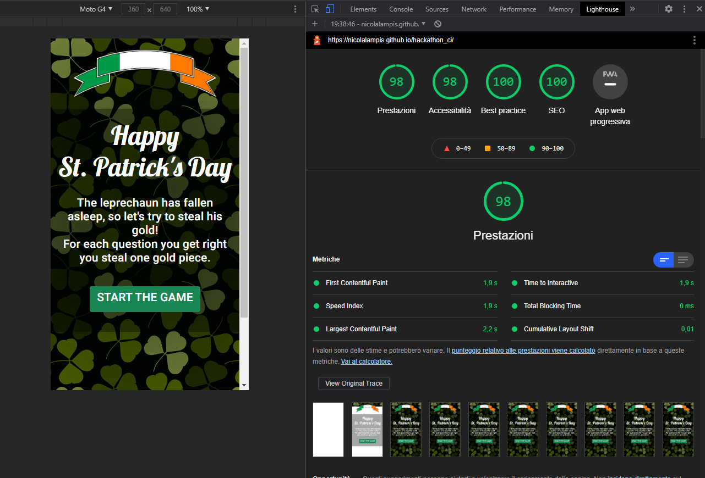

# **Steal the Gold Testing Details** #

[Main README.md file](https://github.com/NicolaLampis/hackathon_ci/blob/master/README.md)

[View the live project here.](https://nicolalampis.github.io/hackathon_ci/)

---

## **Table of Contents** ##

- [**Steal the Gold Testing Details**](#steal-the-gold-testing-details)
  - [**Table of Contents**](#table-of-contents)
  - [**Automated Testing**](#automated-testing)
    - [**Validation Services**](#validation-services)
    - [**HTML validation**](#html-validation)
      - [**index.html**](#indexhtml)
      - [**game.html**](#gamehtml)
    - [**CSS validation** ###](#css-validation-)
      - [**style.css**](#stylecss)
  - [**Manual Testing**](#manual-testing)
    - [**Unit Testing**](#unit-testing)
    - [**Peer Code Review**](#peer-code-review)
    - [**Testing undertaken on desktop**](#testing-undertaken-on-desktop)
    - [**Testing undertaken on tablet and phone devices**](#testing-undertaken-on-tablet-and-phone-devices)
  - [**Bugs discovered**](#bugs-discovered)
      - [**Known Bugs**](#known-bugs)
      - [**Unsolved Issues**](#unsolved-issues)

---
## **Automated Testing** ##

### **Validation Services** ###

The following **validation services** and **linters** were used to check the validity of the website code.

- [W3C Markup Validation](https://validator.w3.org/) 
  - This validator checks the markup validity of Web documents in HTML, XHTML, SMIL, MathML, etc.
    - Document checking completed. No errors or warnings to show.

- [W3C CSS validation](https://jigsaw.w3.org/css-validator/)
  - This validator checks the validity of cascading style sheets (css) and (X)HTML documents with style sheets.
    - Congratulations! No Error Found. This document validates as CSS level 3 + SVG

- [Chrome DevTools Lighthouse](https://developers.google.com/web/tools/lighthouse)
  - An open-source automated tool for improving webpages by running audits for performance, accessibility, progressive web apps, SEO etc.
    - The metrics scores and the perf score are colored according to the range green (90 to 100), that means “Good” score.
        - Performance. 100%
            The following changes improved the performance of the webapp.
            Order of the <script> : jQuery, bootstrap, script.js
            Resize the images improving the loading speed.
        - Accessibility. 98%
            Flags, provide links with descriptive text.
        - SEO. 100%
            Add a media description provide a brief summary of a web page and help the search engine.
        - Best Practice 100%

### **HTML validation** ###

#### **index.html** ###

- 
#### **game.html** ###

- 

### **CSS validation** ### 
#### **style.css** ###
- 

  - **Desktop Performance Report**
    
    [Google Lighthouse - First Report Desktop](assets/images/screenshots/s-one.png)
    
    

  - **Mobile Performance Report**

    

- [JSHint (version 2.12.0)](https://jshint.com/)
  - JSHint is a community-driven tool that detects errors and potential problems in JavaScript code.  

  - script.js testing using JSHint passed the test successfully with the following selected additional option:
    - jQuery
    - New JavaScript features (ES6)
      - Scripts use ECMAScript 6 features such as `const`

---

## **Manual Testing** ##

### **Unit Testing** ###
[Unit Testing document](testing/game-unit-test-plan.pdf) containing:
- Unit Test scope,
- The test cases,
- The pass / fail record for each test case.

### **Peer Code Review** ###
The deployed website link was subjected to peer code review and testing:
- Team-18 project team members

### **Testing undertaken on desktop** ###

- Hardware:
    - Macbook Pro Laptop 17" (2009)
    - Dell 5590 Laptop
- Tested Operating Systems:
    - Windows 10
    - OSX 10.11 
- Tested Browsers:
    - Windows 10:
        - Chrome
        - Firefox
        - Edge 
    - OSX 10.11
        - Chrome
        - Firefox
        - Safari

### **Testing undertaken on tablet and phone devices** ###

- Hardware:
    - iPad Pro 12.9"
    - iPad Pro 10.5"
    - iPhone XS Max
- Tested Operating Systems:
    - iOS 14.4
    - iPadOS 14.4
- Tested Browsers:
    - iOS / iPadOS
        - Chrome
        - Firefox
        - Edge
        - Safari

---

## **Bugs discovered** ##

The issue log is managed on the [GitHub Project Issues section](https://github.com/NicolaLampis/hackathon_ci/issues) using the standard GitHub [bug\_report.md template](https://github.com/NicolaLampis/hackathon_ci/blob/master/.github/ISSUE_TEMPLATE/bug_report.md)

#### **Known Bugs** ####

#### **Unsolved Issues** ####

